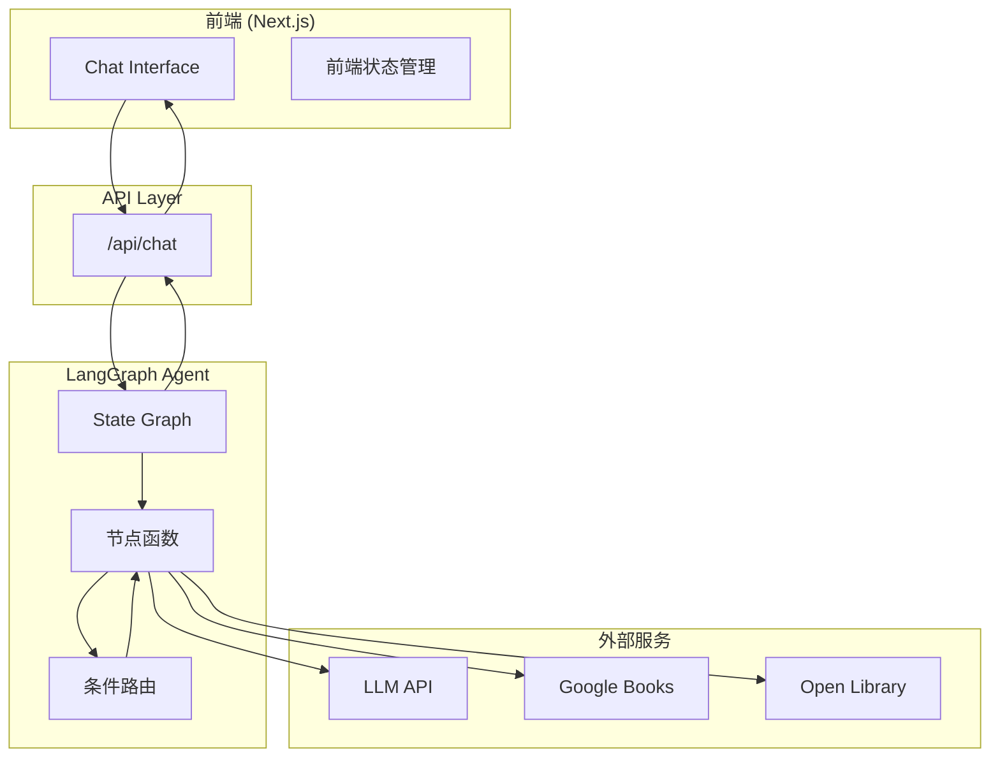
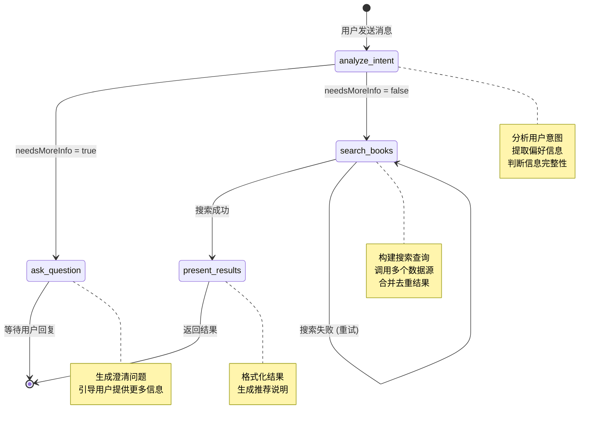
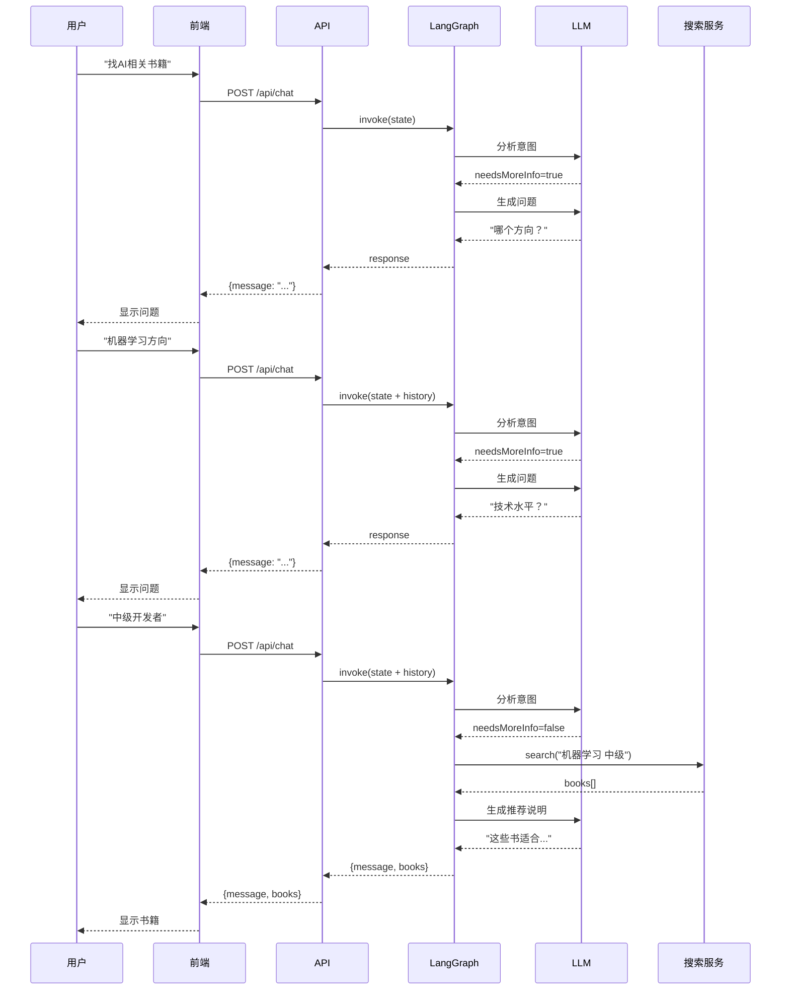
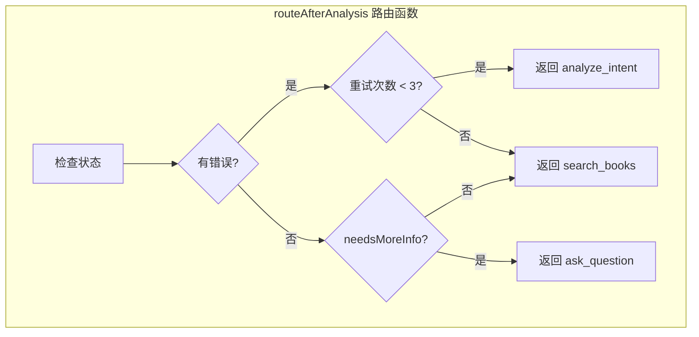
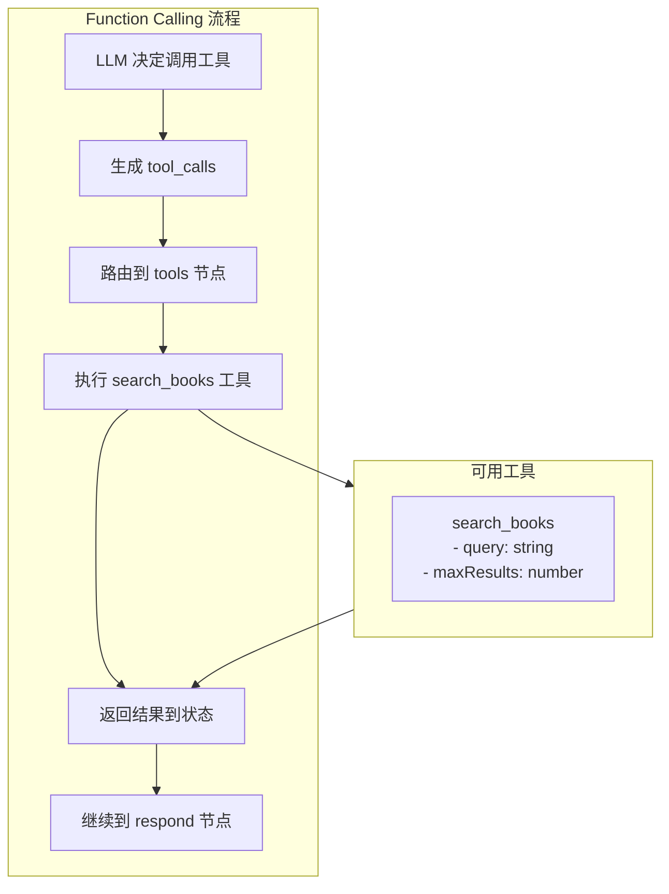
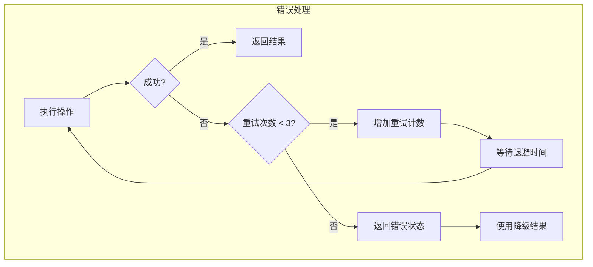

# LangGraph 流程图 (Mermaid 格式)

## 1. 整体系统架构



## 2. 状态机流转图



## 3. 多轮对话时序图



## 4. 节点处理流程图

```mermaid
flowchart TD
    subgraph AnalyzeIntent["analyze_intent 节点"]
        A1[接收用户消息]
        A2[调用 LLM 分析]
        A3{提取到足够信息?}
        A4[更新 preferences]
        A5[设置 needsMoreInfo]

        A1 --> A2 --> A3
        A3 -->|是| A4
        A3 -->|否| A5
        A4 --> A6[返回状态]
        A5 --> A6
    end

    subgraph AskQuestion["ask_question 节点"]
        B1[获取缺失信息列表]
        B2[构建提问 prompt]
        B3[调用 LLM 生成问题]
        B4[添加 AI 消息]

        B1 --> B2 --> B3 --> B4
    end

    subgraph SearchBooks["search_books 节点"]
        C1[构建搜索查询]
        C2[并行调用 API]
        C3[Google Books]
        C4[Open Library]
        C5[合并结果]
        C6[去重排序]

        C1 --> C2
        C2 --> C3
        C2 --> C4
        C3 --> C5
        C4 --> C5
        C5 --> C6
    end

    subgraph PresentResults["present_results 节点"]
        D1{有搜索结果?}
        D2[生成推荐说明]
        D3[返回空结果提示]
        D4[格式化输出]

        D1 -->|是| D2 --> D4
        D1 -->|否| D3
    end
```



## 5. 条件路由决策图



## 6. 状态数据流图

```mermaid
flowchart LR
    subgraph State["BookAgentState"]
        direction TB
        S1[userMessage]
        S2[messages: Message[]]
        S3[preferences: {...}]
        S4[books: Book[]]
        S5[needsMoreInfo: boolean]
        S6[currentPhase: string]
    end

    subgraph Nodes
        N1[analyze_intent]
        N2[ask_question]
        N3[search_books]
        N4[present_results]
    end

    S1 --> N1
    S2 --> N1
    N1 -->|更新| S3
    N1 -->|更新| S5

    S2 --> N2
    S5 --> N2
    N2 -->|追加| S2

    S3 --> N3
    N3 -->|设置| S4

    S4 --> N4
    N4 -->|追加| S2
```

## 7. 工具调用流程



## 8. 错误处理流程



---

## 如何查看这些图

### 方法 1: VS Code 插件

安装 "Markdown Preview Mermaid Support" 插件，然后预览此文件。

### 方法 2: 在线工具

复制 Mermaid 代码到 https://mermaid.live/ 查看。

### 方法 3: GitHub

GitHub 原生支持 Mermaid 图表，直接在 GitHub 上查看此文件。

### 方法 4: Notion

将 Mermaid 代码块粘贴到 Notion，会自动渲染。
